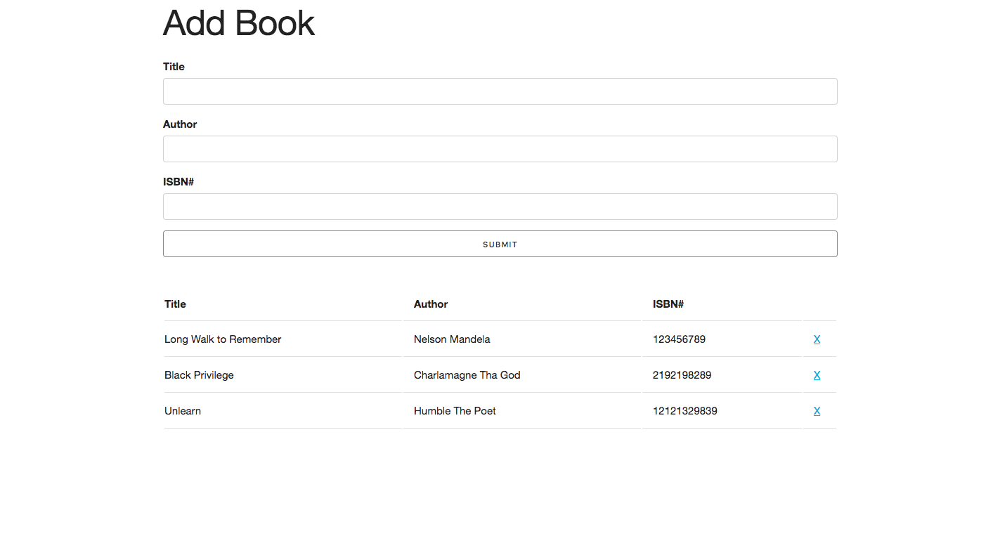

# BOOKLIST
This project is a simple Booklist that essentially takes in the input of the user and puts them into the table below.
I also added alert messages help the user know when information is added within all fields and when there is input information missing.

## How It's Made:

**Tech used:** HTML, CSS, JavaScript

I gained all my confidence with working on Javascript working on this project. It helped boost my understanding of functions, calling and making methods. It was also fun understanding the ES5 and ES6 versions working on this project. 
